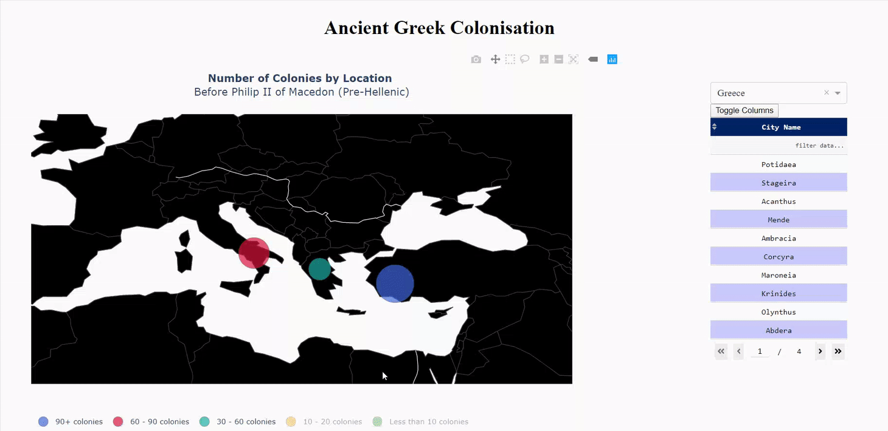

# Ancient Greek Colonies Visualisation 🏛️

## Description

An enhanced, interactive web application built with Dash to visualize ancient Greek colonies across the Mediterranean during the Pre-Hellenic period (before Philip II of Macedon). This application provides rich, interactive features for exploring historical settlement patterns with modern data visualization techniques.

**🆕 NEW: AI-Powered Chat Agent!** - Explore the data through natural language conversations. See [README_CHAT_AGENT.md](README_CHAT_AGENT.md) for details.

The dataset came from: https://en.wikipedia.org/wiki/Greek_colonisation

## 🚀 Available Interfaces

### 1. AI Chat Agent (app.py) 🤖 ⭐ **NEW**
An agentic chat interface powered by OpenRouter LLMs:
- **Natural Language Queries**: Ask questions in plain English
- **Interactive Visualizations**: Request maps and charts on demand
- **Multiple LLM Options**: Claude, GPT-4, Llama, Gemini, and more
- **Historical Expertise**: Deep knowledge of Greek colonization
- **Context-Aware**: Maintains conversation history

**Quick Start:**
```bash
# Set up your OpenRouter API key
cp .env.example .env
# Edit .env with your API key

# Run the chat agent
chainlit run app.py
```

See [README_CHAT_AGENT.md](README_CHAT_AGENT.md) for full documentation.

### 2. Professional Dashboard (GR03B_Greek_Colonies_Dashboard_Professional.py)

**Modern Design & Theme:**
- 🎨 **Bootstrap LUX Theme** - Professional, elegant design with dash-bootstrap-components
- 🏛️ **Thematic Typography** - Elegant serif fonts (Cinzel/Garamond) for ancient Greek aesthetic
- 🎯 **FontAwesome Icons** - Visual icons on all KPI cards (city, flag, chart, crown icons)
- 📐 **Two-Column Layout** - Main map (65%) with details panel (35%) for optimal information hierarchy
- 🌈 **Professional Color Palette** - Cohesive color scheme inspired by ancient Greece

**Advanced Interactive Features:**
- 🔄 **Comprehensive Cross-Filtering** - All components interact seamlessly:
  - **Dropdown → All**: Selecting a country updates KPIs, zooms map, filters table
  - **Map Click → All**: Clicking a colony on the map triggers full filtering
  - **Bar Chart Click → All**: Clicking a bar filters the entire dashboard
  - **Reset Button**: Restores global view across all components
- 📊 **Dynamic KPI Cards** - Real-time updates showing filtered statistics
- 🗺️ **Smart Map Zoom** - Automatically zooms to selected country (15x scale)
- 📈 **Single-Color Bar Chart** - Replaced rainbow colors with professional blue theme
- 📊 **Horizontal Bar Chart** - Replaced pie chart for better colony range comparison
- 🎯 **Context-Aware Info Panel** - Shows overview or selected country details
- 📋 **Smart Table Columns** - Dynamically hides/shows Country column based on selection

**Enhanced Visualizations:**
- Bubble map with size and opacity adjustments based on selection
- Rich hover tooltips with country name and colony counts
- Professional color-coded categories (90+, 60-90, 30-60, 10-20, <10 colonies)
- Clean, modern chart styling with grid lines and proper spacing

### Enhanced Visualization (GR03B_Greek_Colonies_Dashboard_Enhanced.py)

**Interactive Components:**
- 📊 **Summary Statistics Dashboard** - Real-time stats showing total colonies, countries, averages, and top colonizer
- 🗺️ **Enhanced Bubble Map** - Interactive geographical visualization with:
  - Country highlighting on selection
  - Custom color-coded categories
  - Rich hover tooltips
  - Zoom, pan, and reset controls
- 📈 **Top 10 Countries Bar Chart** - Horizontal bar chart with gradient colors
- 🥧 **Category Distribution Pie Chart** - Visual breakdown of colony ranges
- 🔍 **Advanced Search & Filter** - Real-time search through colony names
- 📋 **Interactive Data Table** - Sortable, filterable colony listings with pagination

**Design Improvements:**
- Modern, responsive layout with clean UI
- Professional color scheme with high contrast
- Card-based statistics display
- Smooth interactions and transitions
- Emoji icons for visual appeal
- Consistent spacing and typography

**User Experience:**
- Country selection dropdown with highlighting
- Reset view button for quick navigation
- Dynamic info panel showing selected country details
- Integrated search functionality
- Mobile-friendly responsive design

## Demo

Watch longer demo on Youtube: https://youtu.be/shfUQK9v7Aw

### Professional Version Screenshots ⭐ **NEW**


*Professional dashboard with Bootstrap LUX theme, FontAwesome icons, and comprehensive cross-filtering*


*Greece selected showing dynamic KPI updates, automatic map zoom, filtered table, and horizontal bar charts*

### Enhanced Version Screenshots

*Overview showing all colonies with statistics cards, multiple charts, and interactive controls*


*Greece selected showing filtered data, updated statistics, and highlighted map markers*

### Original Version


## 🚀 Getting Started

### Installation

1. Clone this repository
2. Install required dependencies:
```bash
pip install -r requirements.txt
```

### Running the Applications

**AI Chat Agent (NEW - Recommended for exploration):**
```bash
# First, set up your OpenRouter API key
cp .env.example .env
# Edit .env and add your OpenRouter API key

# Run the chat agent
chainlit run app.py
# Opens at: http://localhost:8000
```

**Professional Dashboard:**
```bash
python GR03B_Greek_Colonies_Dashboard_Professional.py
# Opens at: http://127.0.0.1:8050/
```

**Enhanced Version:**
```bash
python GR03B_Greek_Colonies_Dashboard_Enhanced.py
# Opens at: http://127.0.0.1:8050/
```

**Original Version:**
```bash
python GR03B_Greek_Colonies_Dashboard.py
# Opens at: http://127.0.0.1:8050/
```

## 📁 Project Structure

### Chat Agent (NEW)
- **app.py** - Main Chainlit chat application ⭐ **NEW**
- **config.py** - Configuration for LLMs and agent settings ⭐ **NEW**
- **agent_tools.py** - Data analysis and visualization utilities ⭐ **NEW**
- **.env.example** - Environment variable template ⭐ **NEW**
- **README_CHAT_AGENT.md** - Detailed chat agent documentation ⭐ **NEW**

### Dash Dashboards
- **GR03B_Greek_Colonies_Dashboard_Professional.py** - Professional dashboard with Bootstrap theme
- **GR03B_Greek_Colonies_Dashboard_Enhanced.py** - Enhanced dashboard with advanced features
- **GR03B_Greek_Colonies_Dashboard.py** - Original dashboard

### Data Processing
- **GR03A_DataFrame.py** - Data processing and wrangling module

### Data Files
- **GR03-Ancient Greek Cities Before Hellenistic Period 20200131.txt** - Source data
- **GR03-Country Code Mapping.csv** - Country code to name mapping
- **GR03-Selected Capital Geo Coordinates Modified.csv** - Geographical coordinates

### Configuration
- **requirements.txt** - Python dependencies
- **README.md** - This file

## 🛠️ Technical Details

### Data Processing Pipeline

1. **Data Extraction** - Raw data extracted from Wikipedia and stored in text format
2. **Data Wrangling** - GR03A_DataFrame.py processes the text data:
   - Parses colony codes and names using regex
   - Maps country codes to full country names
   - Assigns geographical coordinates
   - Categorizes countries by colony count
3. **Visualization** - Dashboard applications render interactive visualizations

### Technologies Used

**Chat Agent:**
- **Chainlit** - AI chat application framework ⭐ **NEW**
- **OpenRouter** - Multi-model LLM API gateway ⭐ **NEW**
- **OpenAI SDK** - Client library for API calls ⭐ **NEW**
- **Plotly** - Interactive visualizations in chat
- **Pandas** - Data manipulation and analysis
- **Python 3.9+** - Core programming language

**Dash Dashboards:**
- **Dash** - Web application framework
- **Dash Bootstrap Components** - Bootstrap theme integration
- **Plotly** - Interactive graphing library
- **Pandas** - Data manipulation and analysis
- **Python 3.12+** - Core programming language

### Chat Agent Capabilities ⭐ **NEW**

- ✅ Natural language query processing
- ✅ Context-aware conversation with memory
- ✅ Multiple LLM model options (Claude, GPT-4, Llama, Gemini)
- ✅ On-demand visualization generation
- ✅ Historical data analysis and insights
- ✅ Country/region comparisons
- ✅ Statistical summaries
- ✅ Interactive maps, charts, and tables
- ✅ Streaming responses for better UX
- ✅ Model switching via settings

### Key Improvements in Professional Version

- ✅ Bootstrap LUX theme integration
- ✅ FontAwesome icons on KPI cards
- ✅ Comprehensive cross-filtering (dropdown, map click, bar chart click)
- ✅ Automatic map zoom on country selection (15x scale)
- ✅ Dynamic KPI cards that update with selection
- ✅ Horizontal bar chart replacing pie chart
- ✅ Single-color professional bar chart theme
- ✅ Smart table column hiding/showing
- ✅ Context-aware info panel with Bootstrap alerts
- ✅ Two-column responsive layout (65/35 split)
- ✅ Elegant serif typography for ancient Greek aesthetic
- ✅ Professional color palette with theme constants
- ✅ Advanced callback with ctx.triggered_id for interaction handling

### Key Improvements in Enhanced Version

- ✅ Modern Dash API (updated from deprecated components)
- ✅ Responsive card-based layout
- ✅ Multiple coordinated visualizations
- ✅ Real-time filtering and search
- ✅ Enhanced color schemes and styling
- ✅ Interactive country highlighting
- ✅ Summary statistics dashboard
- ✅ Professional UI/UX design
- ✅ Better error handling
- ✅ Improved code organization

## 📊 Data Categories

Colonies are categorized into 5 ranges:
- **90+ colonies** - Major colonization centers (e.g., Turkey: 98)
- **60-90 colonies** - Significant presence (e.g., Italy: 65)
- **30-60 colonies** - Moderate presence (e.g., Greece: 34)
- **10-20 colonies** - Minor presence (e.g., Albania: 15)
- **Less than 10 colonies** - Limited presence

## 🤝 Contributing

Contributions are welcome! Please feel free to submit a Pull Request.

## 📝 License

This project uses historical data from Wikipedia and is intended for educational purposes.

## 🙏 Acknowledgments

- Data source: [Wikipedia - Greek Colonisation](https://en.wikipedia.org/wiki/Greek_colonisation)
- Built with Dash by Plotly
